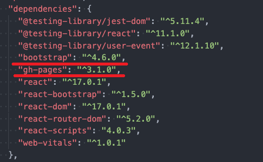

# GitHub Pages Tutorial
by reikamoon :ribbon:

## :exclamation: OBJECTIVE 
Once you’ve finished a polished React project, you’ll probably want to deploy it, so others can see your work without having to install it. Here are some fast and easy tips on how to get your react project from localhost to your very own Github Pages!

## :one: Install GH Pages
First, you’ll want to install the [GitHub Pages add-on](https://www.npmjs.com/package/gh-pages). The GitHub Pages Dependency is really handy because it publishes all your files in your react project to a gh-pages branch on GitHub. <br>
Open your <b>terminal</b>, make sure you’re in the folder of your project (to jump to your project's folder, you can use `cd yourprojectname` in the terminal!), and enter the following command:

```npm install gh-pages --save-dev```

Let's check if it was installed properly. We can double-check by referring to your `project.json` file in your project. See if you can find `gh-pages` listed in your dependencies!

<p>Found it!</p>
<br>
If you still cannot find gh-pages in your dependencies, you can try installing it again. Make sure you're in the correct directory.

